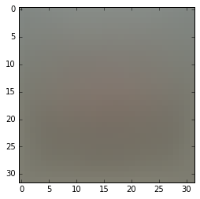

## CS231 First Assignment


# Multiclass Support Vector Machine exercise

*Complete and hand in this completed worksheet (including its outputs and any supporting code outside of the worksheet) with your assignment submission. For more details see the [assignments page](http://vision.stanford.edu/teaching/cs231n/assignments.html) on the course website.*

In this exercise you will:
    
- implement a fully-vectorized **loss function** for the SVM
- implement the fully-vectorized expression for its **analytic gradient**
- **check your implementation** using numerical gradient
- use a validation set to **tune the learning rate and regularization** strength
- **optimize** the loss function with **SGD**
- **visualize** the final learned weights


```python
# Run some setup code for this notebook.

import random
import numpy as np
from cs231n.data_utils import load_CIFAR10
import matplotlib.pyplot as plt

# This is a bit of magic to make matplotlib figures appear inline in the
# notebook rather than in a new window.
%matplotlib inline
plt.rcParams['figure.figsize'] = (10.0, 8.0) # set default size of plots
plt.rcParams['image.interpolation'] = 'nearest'
plt.rcParams['image.cmap'] = 'gray'

# Some more magic so that the notebook will reload external python modules;
# see http://stackoverflow.com/questions/1907993/autoreload-of-modules-in-ipython
%load_ext autoreload
%autoreload 2
```

## CIFAR-10 Data Loading and Preprocessing


```python
# Load the raw CIFAR-10 data.
cifar10_dir = 'cs231n/datasets/cifar-10-batches-py'
X_train, y_train, X_test, y_test = load_CIFAR10(cifar10_dir)

# As a sanity check, we print out the size of the training and test data.
print 'Training data shape: ', X_train.shape
print 'Training labels shape: ', y_train.shape
print 'Test data shape: ', X_test.shape
print 'Test labels shape: ', y_test.shape
```

    Training data shape:  (50000, 32, 32, 3)
    Training labels shape:  (50000,)
    Test data shape:  (10000, 32, 32, 3)
    Test labels shape:  (10000,)


```python
# Visualize some examples from the dataset.
# We show a few examples of training images from each class.
classes = ['plane', 'car', 'bird', 'cat', 'deer', 'dog', 'frog', 'horse', 'ship', 'truck']
num_classes = len(classes)
samples_per_class = 7
for y, cls in enumerate(classes):
    idxs = np.flatnonzero(y_train == y)
    idxs = np.random.choice(idxs, samples_per_class, replace=False)
    for i, idx in enumerate(idxs):
        plt_idx = i * num_classes + y + 1
        plt.subplot(samples_per_class, num_classes, plt_idx)
        plt.imshow(X_train[idx].astype('uint8'))
        plt.axis('off')
        if i == 0:
            plt.title(cls)
plt.show()
```


```python
# Split the data into train, val, and test sets. In addition we will
# create a small development set as a subset of the training data;
# we can use this for development so our code runs faster.
num_training = 49000
num_validation = 1000
num_test = 1000
num_dev = 500

# Our validation set will be num_validation points from the original
# training set.
mask = range(num_training, num_training + num_validation)
X_val = X_train[mask]
y_val = y_train[mask]

# Our training set will be the first num_train points from the original
# training set.
mask = range(num_training)
X_train = X_train[mask]
y_train = y_train[mask]

# We will also make a development set, which is a small subset of
# the training set.
mask = np.random.choice(num_training, num_dev, replace=False)
X_dev = X_train[mask]
y_dev = y_train[mask]

# We use the first num_test points of the original test set as our
# test set.
mask = range(num_test)
X_test = X_test[mask]
y_test = y_test[mask]

print 'Train data shape: ', X_train.shape
print 'Train labels shape: ', y_train.shape
print 'Validation data shape: ', X_val.shape
print 'Validation labels shape: ', y_val.shape
print 'Test data shape: ', X_test.shape
print 'Test labels shape: ', y_test.shape
```

    Train data shape:  (49000, 32, 32, 3)
    Train labels shape:  (49000,)
    Validation data shape:  (1000, 32, 32, 3)
    Validation labels shape:  (1000,)
    Test data shape:  (1000, 32, 32, 3)
    Test labels shape:  (1000,)


```python
# Preprocessing: reshape the image data into rows
X_train = np.reshape(X_train, (X_train.shape[0], -1))
X_val = np.reshape(X_val, (X_val.shape[0], -1))
X_test = np.reshape(X_test, (X_test.shape[0], -1))
X_dev = np.reshape(X_dev, (X_dev.shape[0], -1))

# As a sanity check, print out the shapes of the data
print 'Training data shape: ', X_train.shape
print 'Validation data shape: ', X_val.shape
print 'Test data shape: ', X_test.shape
print 'dev data shape: ', X_dev.shape
```

    Training data shape:  (49000, 3072)
    Validation data shape:  (1000, 3072)
    Test data shape:  (1000, 3072)
    dev data shape:  (500, 3072)


```python
# Preprocessing: subtract the mean image
# first: compute the image mean based on the training data
mean_image = np.mean(X_train, axis=0)
print mean_image[:10] # print a few of the elements
print mean_image.shape
plt.figure(figsize=(4,4))
plt.imshow(mean_image.reshape((32,32,3)).astype('uint8')) # visualize the mean image
plt.show()
```

    [ 130.64189796  135.98173469  132.47391837  130.05569388  135.34804082
      131.75402041  130.96055102  136.14328571  132.47636735  131.48467347]
    (3072,)





```python
# second: subtract the mean image from train and test data
X_train -= mean_image
X_val -= mean_image
X_test -= mean_image
X_dev -= mean_image
```


```python
# third: append the bias dimension of ones (i.e. bias trick) so that our SVM
# only has to worry about optimizing a single weight matrix W.
X_train = np.hstack([X_train, np.ones((X_train.shape[0], 1))])
X_val = np.hstack([X_val, np.ones((X_val.shape[0], 1))])
X_test = np.hstack([X_test, np.ones((X_test.shape[0], 1))])
X_dev = np.hstack([X_dev, np.ones((X_dev.shape[0], 1))])

print X_train.shape, X_val.shape, X_test.shape, X_dev.shape
```

    (49000, 3073) (1000, 3073) (1000, 3073) (500, 3073)


## SVM Classifier

Your code for this section will all be written inside **cs231n/classifiers/linear_svm.py**. 

As you can see, we have prefilled the function `compute_loss_naive` which uses for loops to evaluate the multiclass SVM loss function. 


```python
# Evaluate the naive implementation of the loss we provided for you:
from cs231n.classifiers.linear_svm import svm_loss_naive
import time

# generate a random SVM weight matrix of small numbers
W = np.random.randn(3073, 10) * 0.0001 

loss, grad = svm_loss_naive(W, X_dev, y_dev, 0.00001)
print 'loss: %f' % (loss, )
```

    loss: 8.653124


The `grad` returned from the function above is right now all zero. Derive and implement the gradient for the SVM cost function and implement it inline inside the function `svm_loss_naive`. You will find it helpful to interleave your new code inside the existing function.

To check that you have correctly implemented the gradient correctly, you can numerically estimate the gradient of the loss function and compare the numeric estimate to the gradient that you computed. We have provided code that does this for you:


```python
# Once you've implemented the gradient, recompute it with the code below
# and gradient check it with the function we provided for you

# Compute the loss and its gradient at W.
loss, grad = svm_loss_naive(W, X_dev, y_dev, 0.0)

# Numerically compute the gradient along several randomly chosen dimensions, and
# compare them with your analytically computed gradient. The numbers should match
# almost exactly along all dimensions.
from cs231n.gradient_check import grad_check_sparse
f = lambda w: svm_loss_naive(w, X_dev, y_dev, 0.0)[0]
grad_numerical = grad_check_sparse(f, W, grad)

# do the gradient check once again with regularization turned on
# you didn't forget the regularization gradient did you?
loss, grad = svm_loss_naive(W, X_dev, y_dev, 1e2)
f = lambda w: svm_loss_naive(w, X_dev, y_dev, 1e2)[0]
grad_numerical = grad_check_sparse(f, W, grad)
```

    numerical: 11.072448 analytic: 11.072448, relative error: 2.171289e-11
    numerical: 9.327705 analytic: 9.327705, relative error: 1.533537e-11
    numerical: 6.656094 analytic: 6.656094, relative error: 1.095542e-11
    numerical: 0.634333 analytic: 0.634333, relative error: 4.265138e-10
    numerical: 25.010516 analytic: 25.010516, relative error: 5.571722e-12
    numerical: 0.052641 analytic: 0.076000, relative error: 1.815857e-01
    numerical: -13.288814 analytic: -13.288814, relative error: 1.589353e-11
    numerical: -17.558994 analytic: -17.558994, relative error: 9.103440e-12
    numerical: 17.492858 analytic: 17.492858, relative error: 7.175756e-12
    numerical: 3.037504 analytic: 3.037504, relative error: 9.756793e-13
    numerical: 2.302554 analytic: 2.302554, relative error: 5.423364e-11
    numerical: 14.485343 analytic: 14.485343, relative error: 5.545389e-12
    numerical: -32.013887 analytic: -32.013887, relative error: 9.888129e-12
    numerical: 14.817290 analytic: 14.817290, relative error: 2.230089e-11
    numerical: 5.939546 analytic: 5.939546, relative error: 1.278349e-11
    numerical: 3.075197 analytic: 3.075197, relative error: 2.609013e-11
    numerical: -6.854354 analytic: -6.854354, relative error: 4.652719e-12
    numerical: 39.496493 analytic: 39.496493, relative error: 4.631801e-12
    numerical: -18.764740 analytic: -18.764740, relative error: 2.351213e-11
    numerical: -25.050225 analytic: -25.050225, relative error: 2.196281e-12


### Inline Question 1:
It is possible that once in a while a dimension in the gradcheck will not match exactly. What could such a discrepancy be caused by? Is it a reason for concern? What is a simple example in one dimension where a gradient check could fail? *Hint: the SVM loss function is not strictly speaking differentiable*

**Your Answer:** *fill this in.*


```python
# Next implement the function svm_loss_vectorized; for now only compute the loss;
# we will implement the gradient in a moment.
tic = time.time()
loss_naive, grad_naive = svm_loss_naive(W, X_dev, y_dev, 0.00001)
toc = time.time()
print 'Naive loss: %e computed in %fs' % (loss_naive, toc - tic)

from cs231n.classifiers.linear_svm import svm_loss_vectorized
tic = time.time()
loss_vectorized, _ = svm_loss_vectorized(W, X_dev, y_dev, 0.00001)
toc = time.time()
print 'Vectorized loss: %e computed in %fs' % (loss_vectorized, toc - tic)

# The losses should match but your vectorized implementation should be much faster.
print 'difference: %f' % (loss_naive - loss_vectorized)
```

    Naive loss: 8.653124e+00 computed in 0.097491s
    Vectorized loss: 8.653124e+00 computed in 0.011636s
    difference: -0.000000


```python
# Complete the implementation of svm_loss_vectorized, and compute the gradient
# of the loss function in a vectorized way.

# The naive implementation and the vectorized implementation should match, but
# the vectorized version should still be much faster.
tic = time.time()
_, grad_naive = svm_loss_naive(W, X_dev, y_dev, 0.00001)
toc = time.time()
print 'Naive loss and gradient: computed in %fs' % (toc - tic)

tic = time.time()
_, grad_vectorized = svm_loss_vectorized(W, X_dev, y_dev, 0.00001)
toc = time.time()
print 'Vectorized loss and gradient: computed in %fs' % (toc - tic)

# The loss is a single number, so it is easy to compare the values computed
# by the two implementations. The gradient on the other hand is a matrix, so
# we use the Frobenius norm to compare them.
difference = np.linalg.norm(grad_naive - grad_vectorized, ord='fro')
print 'difference: %f' % difference
```

    Naive loss and gradient: computed in 0.088579s
    Vectorized loss and gradient: computed in 0.013150s
    difference: 0.000000


### Stochastic Gradient Descent

We now have vectorized and efficient expressions for the loss, the gradient and our gradient matches the numerical gradient. We are therefore ready to do SGD to minimize the loss.


```python
# In the file linear_classifier.py, implement SGD in the function
# LinearClassifier.train() and then run it with the code below.
from cs231n.classifiers import LinearSVM
svm = LinearSVM()
tic = time.time()
loss_hist = svm.train(X_train, y_train, learning_rate=1e-7, reg=5e4,
                      num_iters=1500, verbose=True)
toc = time.time()
print 'That took %fs' % (toc - tic)
```

    iteration 0 / 1500: loss 782.564895
    iteration 100 / 1500: loss 288.232919
    iteration 200 / 1500: loss 108.212554
    iteration 300 / 1500: loss 42.939490
    iteration 400 / 1500: loss 18.819648
    iteration 500 / 1500: loss 10.602436
    iteration 600 / 1500: loss 7.169914
    iteration 700 / 1500: loss 5.912107
    iteration 800 / 1500: loss 5.174175
    iteration 900 / 1500: loss 5.538879
    iteration 1000 / 1500: loss 5.548001
    iteration 1100 / 1500: loss 5.097116
    iteration 1200 / 1500: loss 5.473498
    iteration 1300 / 1500: loss 5.222231
    iteration 1400 / 1500: loss 5.616049
    That took 6.551287s


```python
# A useful debugging strategy is to plot the loss as a function of
# iteration number:
plt.plot(loss_hist)
plt.xlabel('Iteration number')
plt.ylabel('Loss value')
plt.show()
```


```python
# Write the LinearSVM.predict function and evaluate the performance on both the
# training and validation set
y_train_pred = svm.predict(X_train)
print y_train_pred.shape
print 'training accuracy: %f' % (np.mean(y_train == y_train_pred), )
y_val_pred = svm.predict(X_val)
print 'validation accuracy: %f' % (np.mean(y_val == y_val_pred), )
```

    (49000,)
    training accuracy: 0.364388
    validation accuracy: 0.372000


```python
# Use the validation set to tune hyperparameters (regularization strength and
# learning rate). You should experiment with different ranges for the learning
# rates and regularization strengths; if you are careful you should be able to
# get a classification accuracy of about 0.4 on the validation set.
learning_rates = [5e-6,1e-7, 5e-5,1e-6,1e-4]
regularization_strengths = [5e2,5e3,1e4,5e4,1e5]

# results is dictionary mapping tuples of the form
# (learning_rate, regularization_strength) to tuples of the form
# (training_accuracy, validation_accuracy). The accuracy is simply the fraction
# of data points that are correctly classified.
results = {}
best_val = -1   # The highest validation accuracy that we have seen so far.
best_svm = None # The LinearSVM object that achieved the highest validation rate.

################################################################################
# TODO:                                                                        #
# Write code that chooses the best hyperparameters by tuning on the validation #
# set. For each combination of hyperparameters, train a linear SVM on the      #
# training set, compute its accuracy on the training and validation sets, and  #
# store these numbers in the results dictionary. In addition, store the best   #
# validation accuracy in best_val and the LinearSVM object that achieves this  #
# accuracy in best_svm.                                                        #
#                                                                              #
# Hint: You should use a small value for num_iters as you develop your         #
# validation code so that the SVMs don't take much time to train; once you are #
# confident that your validation code works, you should rerun the validation   #
# code with a larger value for num_iters.                                      #
################################################################################

for lr in learning_rates:
    for rg in regularization_strengths:
        svm = LinearSVM()
        svm.train(X_train, y_train, learning_rate=lr, reg=rg,
                      num_iters=1500, verbose=True)
        y_train_pred = svm.predict(X_train)
        y_val_pred = svm.predict(X_val)
        train_accu=np.mean(y_train == y_train_pred)
        val_accu=np.mean(y_val == y_val_pred)
        results[lr,rg]=tuple([train_accu,val_accu])
        if val_accu>best_val:
            best_val=val_accu
            best_svm=svm
            
        


################################################################################
#                              END OF YOUR CODE                                #
################################################################################
    
# Print out results.
for lr, reg in sorted(results):
    train_accuracy, val_accuracy = results[(lr, reg)]
    print 'lr %e reg %e train accuracy: %f val accuracy: %f' % (
                lr, reg, train_accuracy, val_accuracy)
    
print 'best validation accuracy achieved during cross-validation: %f' % best_val
```

    iteration 0 / 1500: loss 37.152950
    iteration 100 / 1500: loss 14.548897
    iteration 200 / 1500: loss 18.342039
    iteration 300 / 1500: loss 15.134591
    iteration 400 / 1500: loss 13.182166
    iteration 500 / 1500: loss 16.014940
    iteration 600 / 1500: loss 9.953015
    iteration 700 / 1500: loss 16.137382
    iteration 800 / 1500: loss 11.570087
    iteration 900 / 1500: loss 9.173731
    iteration 1000 / 1500: loss 13.358242
    iteration 1100 / 1500: loss 10.458961
    iteration 1200 / 1500: loss 17.371382
    iteration 1300 / 1500: loss 8.630249
    iteration 1400 / 1500: loss 15.727295
    iteration 0 / 1500: loss 96.201394
    iteration 100 / 1500: loss 13.909192
    iteration 200 / 1500: loss 16.291300
    iteration 300 / 1500: loss 14.206352
    iteration 400 / 1500: loss 19.427926
    iteration 500 / 1500: loss 11.402330
    iteration 600 / 1500: loss 12.496964
    iteration 700 / 1500: loss 11.478173
    iteration 800 / 1500: loss 19.788205
    iteration 900 / 1500: loss 13.171874
    iteration 1000 / 1500: loss 16.742138
    iteration 1100 / 1500: loss 13.072351
    iteration 1200 / 1500: loss 12.770706
    iteration 1300 / 1500: loss 22.004406
    iteration 1400 / 1500: loss 11.729399
    iteration 0 / 1500: loss 173.801613
    iteration 100 / 1500: loss 13.037682
    iteration 200 / 1500: loss 15.993265
    iteration 300 / 1500: loss 17.208238
    iteration 400 / 1500: loss 29.990194
    iteration 500 / 1500: loss 10.710222
    iteration 600 / 1500: loss 10.939516
    iteration 700 / 1500: loss 15.837702
    iteration 800 / 1500: loss 17.302348
    iteration 900 / 1500: loss 15.653628
    iteration 1000 / 1500: loss 16.075034
    iteration 1100 / 1500: loss 16.566886
    iteration 1200 / 1500: loss 15.099635
    iteration 1300 / 1500: loss 18.630828
    iteration 1400 / 1500: loss 20.926002
    iteration 0 / 1500: loss 786.020154
    iteration 100 / 1500: loss 23.639165
    iteration 200 / 1500: loss 26.817808
    iteration 300 / 1500: loss 27.145093
    iteration 400 / 1500: loss 22.181979
    iteration 500 / 1500: loss 29.517566
    iteration 600 / 1500: loss 37.295569
    iteration 700 / 1500: loss 19.444425
    iteration 800 / 1500: loss 21.711438
    iteration 900 / 1500: loss 25.730682
    iteration 1000 / 1500: loss 21.276350
    iteration 1100 / 1500: loss 19.726466
    iteration 1200 / 1500: loss 19.970901
    iteration 1300 / 1500: loss 26.227535
    iteration 1400 / 1500: loss 19.668703
    iteration 0 / 1500: loss 1544.980156
    iteration 100 / 1500: loss 38.706705
    iteration 200 / 1500: loss 46.991096
    iteration 300 / 1500: loss 21.985329
    iteration 400 / 1500: loss 22.830072
    iteration 500 / 1500: loss 29.482113
    iteration 600 / 1500: loss 29.790784
    iteration 700 / 1500: loss 39.163200
    iteration 800 / 1500: loss 30.131268
    iteration 900 / 1500: loss 32.931505
    iteration 1000 / 1500: loss 42.107676
    iteration 1100 / 1500: loss 33.097656
    iteration 1200 / 1500: loss 22.417558
    iteration 1300 / 1500: loss 36.230294
    iteration 1400 / 1500: loss 35.056916
    iteration 0 / 1500: loss 32.011506
    iteration 100 / 1500: loss 17.644443
    iteration 200 / 1500: loss 18.310370
    iteration 300 / 1500: loss 16.281041
    iteration 400 / 1500: loss 15.971084
    iteration 500 / 1500: loss 15.882826
    iteration 600 / 1500: loss 13.163872
    iteration 700 / 1500: loss 15.198472
    iteration 800 / 1500: loss 13.146184
    iteration 900 / 1500: loss 13.878492
    iteration 1000 / 1500: loss 13.605907
    iteration 1100 / 1500: loss 13.490415
    iteration 1200 / 1500: loss 13.005855
    iteration 1300 / 1500: loss 13.153408
    iteration 1400 / 1500: loss 12.855336
    iteration 0 / 1500: loss 98.205551
    iteration 100 / 1500: loss 79.059368
    iteration 200 / 1500: loss 71.310475
    iteration 300 / 1500: loss 63.887660
    iteration 400 / 1500: loss 58.853182
    iteration 500 / 1500: loss 54.566245
    iteration 600 / 1500: loss 47.394627
    iteration 700 / 1500: loss 43.765058
    iteration 800 / 1500: loss 39.198777
    iteration 900 / 1500: loss 36.494187
    iteration 1000 / 1500: loss 34.264145
    iteration 1100 / 1500: loss 29.647455
    iteration 1200 / 1500: loss 27.660147
    iteration 1300 / 1500: loss 24.807940
    iteration 1400 / 1500: loss 22.929292
    iteration 0 / 1500: loss 171.416570
    iteration 100 / 1500: loss 132.529899
    iteration 200 / 1500: loss 108.614531
    iteration 300 / 1500: loss 89.944364
    iteration 400 / 1500: loss 73.688761
    iteration 500 / 1500: loss 60.134733
    iteration 600 / 1500: loss 50.384334
    iteration 700 / 1500: loss 41.445027
    iteration 800 / 1500: loss 34.699874
    iteration 900 / 1500: loss 29.034087
    iteration 1000 / 1500: loss 25.183286
    iteration 1100 / 1500: loss 21.625063
    iteration 1200 / 1500: loss 17.564646
    iteration 1300 / 1500: loss 14.824392
    iteration 1400 / 1500: loss 13.991851
    iteration 0 / 1500: loss 791.425873
    iteration 100 / 1500: loss 288.359919
    iteration 200 / 1500: loss 108.119801
    iteration 300 / 1500: loss 42.381817
    iteration 400 / 1500: loss 18.971491
    iteration 500 / 1500: loss 10.092010
    iteration 600 / 1500: loss 6.758557
    iteration 700 / 1500: loss 5.753394
    iteration 800 / 1500: loss 5.465598
    iteration 900 / 1500: loss 6.188988
    iteration 1000 / 1500: loss 5.941465
    iteration 1100 / 1500: loss 5.114091
    iteration 1200 / 1500: loss 5.298513
    iteration 1300 / 1500: loss 4.832217
    iteration 1400 / 1500: loss 5.784839
    iteration 0 / 1500: loss 1547.971324
    iteration 100 / 1500: loss 208.934810
    iteration 200 / 1500: loss 32.431209
    iteration 300 / 1500: loss 9.451549
    iteration 400 / 1500: loss 5.911637
    iteration 500 / 1500: loss 5.797326
    iteration 600 / 1500: loss 5.510241
    iteration 700 / 1500: loss 5.584151
    iteration 800 / 1500: loss 5.960875
    iteration 900 / 1500: loss 5.157924
    iteration 1000 / 1500: loss 5.504579
    iteration 1100 / 1500: loss 5.412305
    iteration 1200 / 1500: loss 5.701887
    iteration 1300 / 1500: loss 6.151538
    iteration 1400 / 1500: loss 6.029005
    iteration 0 / 1500: loss 32.743525
    iteration 100 / 1500: loss 108.134492
    iteration 200 / 1500: loss 144.058428
    iteration 300 / 1500: loss 122.042028
    iteration 400 / 1500: loss 99.429913
    iteration 500 / 1500: loss 104.381345
    iteration 600 / 1500: loss 95.814816
    iteration 700 / 1500: loss 104.927881
    iteration 800 / 1500: loss 186.759252
    iteration 900 / 1500: loss 149.057092
    iteration 1000 / 1500: loss 92.691293
    iteration 1100 / 1500: loss 136.533885
    iteration 1200 / 1500: loss 116.493343
    iteration 1300 / 1500: loss 123.582454
    iteration 1400 / 1500: loss 153.439825
    iteration 0 / 1500: loss 97.379199
    iteration 100 / 1500: loss 183.038127
    iteration 200 / 1500: loss 179.725856
    iteration 300 / 1500: loss 158.236296
    iteration 400 / 1500: loss 181.173233
    iteration 500 / 1500: loss 205.331592
    iteration 600 / 1500: loss 160.158565
    iteration 700 / 1500: loss 194.557093
    iteration 800 / 1500: loss 238.804782
    iteration 900 / 1500: loss 178.112386
    iteration 1000 / 1500: loss 216.616126
    iteration 1100 / 1500: loss 209.954919
    iteration 1200 / 1500: loss 184.371817
    iteration 1300 / 1500: loss 165.000078
    iteration 1400 / 1500: loss 239.230324
    iteration 0 / 1500: loss 177.890039
    iteration 100 / 1500: loss 265.043350
    iteration 200 / 1500: loss 399.858133
    iteration 300 / 1500: loss 340.411543
    iteration 400 / 1500: loss 230.303459
    iteration 500 / 1500: loss 220.157202
    iteration 600 / 1500: loss 257.888643
    iteration 700 / 1500: loss 211.166160
    iteration 800 / 1500: loss 235.942314
    iteration 900 / 1500: loss 332.350022
    iteration 1000 / 1500: loss 289.466873
    iteration 1100 / 1500: loss 273.228572
    iteration 1200 / 1500: loss 214.678277
    iteration 1300 / 1500: loss 272.448423
    iteration 1400 / 1500: loss 191.891455
    iteration 0 / 1500: loss 790.055784
    iteration 100 / 1500: loss 383186916033999680210797110192385294336.000000
    iteration 200 / 1500: loss 63337728306613737908780604854444287211513448610911845840111478350786068480.000000
    iteration 300 / 1500: loss 10469219222209740267670274514724544745465882283836389864102236223315275501638752628422223301496387094588686336.000000
    iteration 400 / 1500: loss 1730478090279739575253889635440596125615265247698015885265425634061048165392185790130932808461684990880762754603150601910125162507700679143849984.000000
    iteration 500 / 1500: loss 286034169060618153973779593416156059152906177476304389329982051406532674330374217961099146446270760423650557806303297780186057778522579069125250209502557780161305743620972799328256.000000
    iteration 600 / 1500: loss 47279157320606376427077240872090789975394037942342594415937763973049692963256308897182799159318165149755840834057227179787646722941252602569699622905708438700080052342360625401961997731873210749084028445571606904832.000000
    iteration 700 / 1500: loss 7814866050051957913748556199010964583298901894238743061418736102197908350231675491814876200398431501744635042437523231828394844600590771868727845867506946077549068208083086095021196796882899400620571778710109087501359992778800234241267383376860413952.000000
    iteration 800 / 1500: loss 1291734769427388446307552290241603616697175171963029034134696493670376684358180079230493874143389862455554589856712206993202584070835440924048728424400373933566732265223544025295189439821973275811316685518810636979250568951232921828164605126680726515655062320504189323447323961902235648.000000
    iteration 900 / 1500: loss inf
    iteration 1000 / 1500: loss inf
    iteration 1100 / 1500: loss inf
    iteration 1200 / 1500: loss inf
    iteration 1300 / 1500: loss inf
    iteration 1400 / 1500: loss inf
    iteration 0 / 1500: loss 1572.024132
    iteration 100 / 1500: loss 4341763734619014513740338992695561042879868005893603222110114260488053711639730194688885783468454737636669646172725268447232.000000
    iteration 200 / 1500: loss 11211518874402111167381174765370457950401436782882394217671006877034324719399857919846696176479814000830566013216316378752395351482843350140839841146418689310393815825706858634525524444090982396220226881948452424917393196870011793413631725535232.000000
    iteration 300 / 1500: loss inf
    iteration 400 / 1500: loss inf
    iteration 500 / 1500: loss inf
    iteration 600 / 1500: loss nan
    iteration 700 / 1500: loss nan
    iteration 800 / 1500: loss nan
    iteration 900 / 1500: loss nan
    iteration 1000 / 1500: loss nan
    iteration 1100 / 1500: loss nan
    iteration 1200 / 1500: loss nan
    iteration 1300 / 1500: loss nan
    iteration 1400 / 1500: loss nan
    iteration 0 / 1500: loss 32.908971
    iteration 100 / 1500: loss 14.995919
    iteration 200 / 1500: loss 12.605685
    iteration 300 / 1500: loss 11.061119
    iteration 400 / 1500: loss 10.293260
    iteration 500 / 1500: loss 9.844360
    iteration 600 / 1500: loss 10.034545
    iteration 700 / 1500: loss 8.436765
    iteration 800 / 1500: loss 7.521646
    iteration 900 / 1500: loss 9.275720
    iteration 1000 / 1500: loss 7.763208
    iteration 1100 / 1500: loss 7.702185
    iteration 1200 / 1500: loss 7.789066
    iteration 1300 / 1500: loss 7.027697
    iteration 1400 / 1500: loss 6.532625
    iteration 0 / 1500: loss 101.017357
    iteration 100 / 1500: loss 33.601589
    iteration 200 / 1500: loss 15.636249
    iteration 300 / 1500: loss 9.443432
    iteration 400 / 1500: loss 6.539679
    iteration 500 / 1500: loss 7.543685
    iteration 600 / 1500: loss 5.809444
    iteration 700 / 1500: loss 5.803156
    iteration 800 / 1500: loss 5.669009
    iteration 900 / 1500: loss 6.066103
    iteration 1000 / 1500: loss 4.658974
    iteration 1100 / 1500: loss 4.912433
    iteration 1200 / 1500: loss 6.053856
    iteration 1300 / 1500: loss 5.221307
    iteration 1400 / 1500: loss 5.572398
    iteration 0 / 1500: loss 175.613675
    iteration 100 / 1500: loss 26.025728
    iteration 200 / 1500: loss 8.988982
    iteration 300 / 1500: loss 6.486513
    iteration 400 / 1500: loss 5.531305
    iteration 500 / 1500: loss 6.344898
    iteration 600 / 1500: loss 5.290283
    iteration 700 / 1500: loss 6.030489
    iteration 800 / 1500: loss 5.610915
    iteration 900 / 1500: loss 6.284320
    iteration 1000 / 1500: loss 5.259200
    iteration 1100 / 1500: loss 5.211446
    iteration 1200 / 1500: loss 5.081148
    iteration 1300 / 1500: loss 5.340420
    iteration 1400 / 1500: loss 5.779462
    iteration 0 / 1500: loss 800.710069
    iteration 100 / 1500: loss 6.056159
    iteration 200 / 1500: loss 7.124872
    iteration 300 / 1500: loss 7.740368
    iteration 400 / 1500: loss 7.711820
    iteration 500 / 1500: loss 6.737988
    iteration 600 / 1500: loss 6.305619
    iteration 700 / 1500: loss 6.270280
    iteration 800 / 1500: loss 7.422135
    iteration 900 / 1500: loss 6.178178
    iteration 1000 / 1500: loss 7.673738
    iteration 1100 / 1500: loss 6.482602
    iteration 1200 / 1500: loss 6.741479
    iteration 1300 / 1500: loss 7.257535
    iteration 1400 / 1500: loss 6.534365
    iteration 0 / 1500: loss 1551.818129
    iteration 100 / 1500: loss 6.725892
    iteration 200 / 1500: loss 7.428046
    iteration 300 / 1500: loss 7.012992
    iteration 400 / 1500: loss 6.601598
    iteration 500 / 1500: loss 6.960894
    iteration 600 / 1500: loss 6.378933
    iteration 700 / 1500: loss 7.516289
    iteration 800 / 1500: loss 6.820155
    iteration 900 / 1500: loss 7.657362
    iteration 1000 / 1500: loss 6.069325
    iteration 1100 / 1500: loss 6.782268
    iteration 1200 / 1500: loss 6.634903
    iteration 1300 / 1500: loss 7.522112
    iteration 1400 / 1500: loss 8.334072
    iteration 0 / 1500: loss 28.488533
    iteration 100 / 1500: loss 208.175972
    iteration 200 / 1500: loss 265.384023
    iteration 300 / 1500: loss 335.768612
    iteration 400 / 1500: loss 216.638359
    iteration 500 / 1500: loss 328.576923
    iteration 600 / 1500: loss 225.926056
    iteration 700 / 1500: loss 309.410510
    iteration 800 / 1500: loss 365.254349
    iteration 900 / 1500: loss 199.753732
    iteration 1000 / 1500: loss 318.866299
    iteration 1100 / 1500: loss 319.305488
    iteration 1200 / 1500: loss 296.738628
    iteration 1300 / 1500: loss 283.077595
    iteration 1400 / 1500: loss 261.656601
    iteration 0 / 1500: loss 101.128936
    iteration 100 / 1500: loss 617.768855
    iteration 200 / 1500: loss 540.472094
    iteration 300 / 1500: loss 353.882360
    iteration 400 / 1500: loss 509.925269
    iteration 500 / 1500: loss 352.793270
    iteration 600 / 1500: loss 342.495645
    iteration 700 / 1500: loss 572.229950
    iteration 800 / 1500: loss 446.060345
    iteration 900 / 1500: loss 660.816280
    iteration 1000 / 1500: loss 577.238616
    iteration 1100 / 1500: loss 547.229908
    iteration 1200 / 1500: loss 596.206450
    iteration 1300 / 1500: loss 487.416347
    iteration 1400 / 1500: loss 432.007038
    iteration 0 / 1500: loss 172.308524
    iteration 100 / 1500: loss 1255.453687
    iteration 200 / 1500: loss 1329.698356
    iteration 300 / 1500: loss 1382.394016
    iteration 400 / 1500: loss 1240.629841
    iteration 500 / 1500: loss 980.311130
    iteration 600 / 1500: loss 1235.831537
    iteration 700 / 1500: loss 1126.634563
    iteration 800 / 1500: loss 1348.801131
    iteration 900 / 1500: loss 911.007326
    iteration 1000 / 1500: loss 812.037103
    iteration 1100 / 1500: loss 914.450718
    iteration 1200 / 1500: loss 896.149744
    iteration 1300 / 1500: loss 1244.662057
    iteration 1400 / 1500: loss 1030.649961
    iteration 0 / 1500: loss 786.717602
    iteration 100 / 1500: loss 2517501704132515209146860565096896085422740734599785680161438110753159129285857078315663258328286707002401347954294002810880.000000
    iteration 200 / 1500: loss 6500818468579772017215155177443235273272546646090415195459824284067594088868286105929074645099811639783867082255619176516883673209400104976389954561552712477174633081831842989827979875477987960717769260988041465586203328088581950513018180730880.000000
    iteration 300 / 1500: loss inf
    iteration 400 / 1500: loss inf
    iteration 500 / 1500: loss inf
    iteration 600 / 1500: loss nan
    iteration 700 / 1500: loss nan
    iteration 800 / 1500: loss nan
    iteration 900 / 1500: loss nan
    iteration 1000 / 1500: loss nan
    iteration 1100 / 1500: loss nan
    iteration 1200 / 1500: loss nan
    iteration 1300 / 1500: loss nan
    iteration 1400 / 1500: loss nan
    iteration 0 / 1500: loss 1567.090477
    iteration 100 / 1500: loss 114279856220429532443072061539958288911061192784808932325238319774058744646389468776302437568303776111659164212027808329003041778463690414816663127160309191259036454005416588600977773256593375232.000000
    iteration 200 / 1500: loss inf
    iteration 300 / 1500: loss inf
    iteration 400 / 1500: loss nan
    iteration 500 / 1500: loss nan
    iteration 600 / 1500: loss nan
    iteration 700 / 1500: loss nan
    iteration 800 / 1500: loss nan
    iteration 900 / 1500: loss nan
    iteration 1000 / 1500: loss nan
    iteration 1100 / 1500: loss nan
    iteration 1200 / 1500: loss nan
    iteration 1300 / 1500: loss nan
    iteration 1400 / 1500: loss nan
    lr 1.000000e-07 reg 5.000000e+02 train accuracy: 0.308571 val accuracy: 0.294000
    lr 1.000000e-07 reg 5.000000e+03 train accuracy: 0.342082 val accuracy: 0.333000
    lr 1.000000e-07 reg 1.000000e+04 train accuracy: 0.374367 val accuracy: 0.398000
    lr 1.000000e-07 reg 5.000000e+04 train accuracy: 0.367837 val accuracy: 0.381000
    lr 1.000000e-07 reg 1.000000e+05 train accuracy: 0.354776 val accuracy: 0.363000
    lr 1.000000e-06 reg 5.000000e+02 train accuracy: 0.370122 val accuracy: 0.358000
    lr 1.000000e-06 reg 5.000000e+03 train accuracy: 0.315531 val accuracy: 0.305000
    lr 1.000000e-06 reg 1.000000e+04 train accuracy: 0.322347 val accuracy: 0.335000
    lr 1.000000e-06 reg 5.000000e+04 train accuracy: 0.252939 val accuracy: 0.247000
    lr 1.000000e-06 reg 1.000000e+05 train accuracy: 0.282918 val accuracy: 0.305000
    lr 5.000000e-06 reg 5.000000e+02 train accuracy: 0.285857 val accuracy: 0.296000
    lr 5.000000e-06 reg 5.000000e+03 train accuracy: 0.261918 val accuracy: 0.245000
    lr 5.000000e-06 reg 1.000000e+04 train accuracy: 0.215224 val accuracy: 0.224000
    lr 5.000000e-06 reg 5.000000e+04 train accuracy: 0.198531 val accuracy: 0.231000
    lr 5.000000e-06 reg 1.000000e+05 train accuracy: 0.153020 val accuracy: 0.158000
    lr 5.000000e-05 reg 5.000000e+02 train accuracy: 0.246408 val accuracy: 0.240000
    lr 5.000000e-05 reg 5.000000e+03 train accuracy: 0.157102 val accuracy: 0.156000
    lr 5.000000e-05 reg 1.000000e+04 train accuracy: 0.151673 val accuracy: 0.171000
    lr 5.000000e-05 reg 5.000000e+04 train accuracy: 0.058163 val accuracy: 0.062000
    lr 5.000000e-05 reg 1.000000e+05 train accuracy: 0.100265 val accuracy: 0.087000
    lr 1.000000e-04 reg 5.000000e+02 train accuracy: 0.206531 val accuracy: 0.213000
    lr 1.000000e-04 reg 5.000000e+03 train accuracy: 0.175041 val accuracy: 0.170000
    lr 1.000000e-04 reg 1.000000e+04 train accuracy: 0.168204 val accuracy: 0.178000
    lr 1.000000e-04 reg 5.000000e+04 train accuracy: 0.100265 val accuracy: 0.087000
    lr 1.000000e-04 reg 1.000000e+05 train accuracy: 0.100265 val accuracy: 0.087000
    best validation accuracy achieved during cross-validation: 0.398000


    cs231n/classifiers/linear_svm.py:80: RuntimeWarning: invalid value encountered in subtract
      tmp=scores-np.reshape(correct_class_score,(correct_class_score.shape[0],-1))


```python
# Visualize the cross-validation results
import math
x_scatter = [math.log10(x[0]) for x in results]
y_scatter = [math.log10(x[1]) for x in results]

# plot training accuracy
marker_size = 100
colors = [results[x][0] for x in results]
plt.subplot(2, 1, 1)
plt.scatter(x_scatter, y_scatter, marker_size, c=colors)
plt.colorbar()
plt.xlabel('log learning rate')
plt.ylabel('log regularization strength')
plt.title('CIFAR-10 training accuracy')

# plot validation accuracy
colors = [results[x][1] for x in results] # default size of markers is 20
plt.subplot(2, 1, 2)
plt.scatter(x_scatter, y_scatter, marker_size, c=colors)
plt.colorbar()
plt.xlabel('log learning rate')
plt.ylabel('log regularization strength')
plt.title('CIFAR-10 validation accuracy')
plt.show()
```


```python
# Evaluate the best svm on test set
y_test_pred = best_svm.predict(X_test)
test_accuracy = np.mean(y_test == y_test_pred)
print 'linear SVM on raw pixels final test set accuracy: %f' % test_accuracy
```

    linear SVM on raw pixels final test set accuracy: 0.373000


```python
# Visualize the learned weights for each class.
# Depending on your choice of learning rate and regularization strength, these may
# or may not be nice to look at.
w = best_svm.W[:-1,:] # strip out the bias
w = w.reshape(32, 32, 3, 10)
w_min, w_max = np.min(w), np.max(w)
classes = ['plane', 'car', 'bird', 'cat', 'deer', 'dog', 'frog', 'horse', 'ship', 'truck']
for i in xrange(10):
  plt.subplot(2, 5, i + 1)
    
  # Rescale the weights to be between 0 and 255
  wimg = 255.0 * (w[:, :, :, i].squeeze() - w_min) / (w_max - w_min)
  plt.imshow(wimg.astype('uint8'))
  plt.axis('off')
  plt.title(classes[i])
```


### Inline question 2:
Describe what your visualized SVM weights look like, and offer a brief explanation for why they look they way that they do.

**Your answer:** *fill this in*
